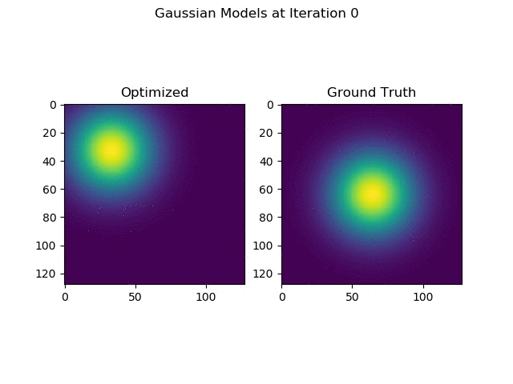

# Simple C++ Extension for PyTorch
Some simple pytorch extensions. Each extension can be built as described below.

## Gaussian Extension
Given the mean, this extension computes a 2D gaussian distribution with diagonal covariance. On backpropagation, it determines the mean that minimizes the difference between a reference distribution and the output of the layer. The gradient for this operation is given in [backward](https://github.com/mhubii/simple_pytorch_extension/blob/3db0d2f2e5af03ee71b8476cd5f94f590d51df88/gaussian/gaussian_extension.cpp#L22).

<br>
<figure>
  <p align="center"></p>
  <figcaption>Fig. 1: Evolution of optimized average for gaussian layer.</figcaption>
</figure>
<br><br>

## Build
```shell
# for example
cd gaussian
python setup.py install
```

## Run
```shell
# for example
cd gaussian
python main.py
```
