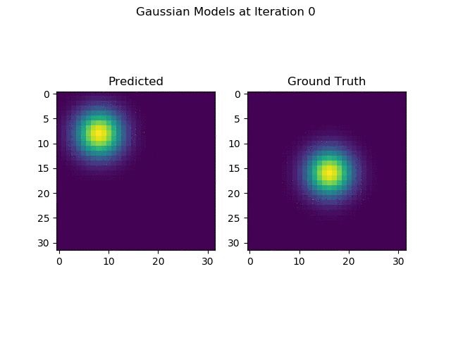

# Simple C++ Extension for PyTorch
Some simple pytorch extensions. Each extension can be built as described below.

<br>
<figure>
  <p align="center"></p>
  <figcaption>Fig. 1: Evolution of learned average for gaussian layer.</figcaption>
</figure>
<br><br>

## Build
```shell
# for example
cd gaussian
python setup.py install
```

## Run
```shell
# for example
cd gaussian
python main.py
```
